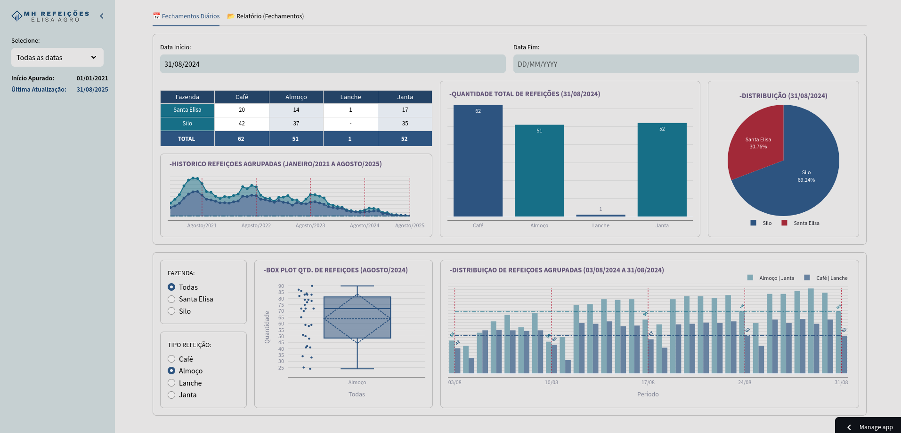
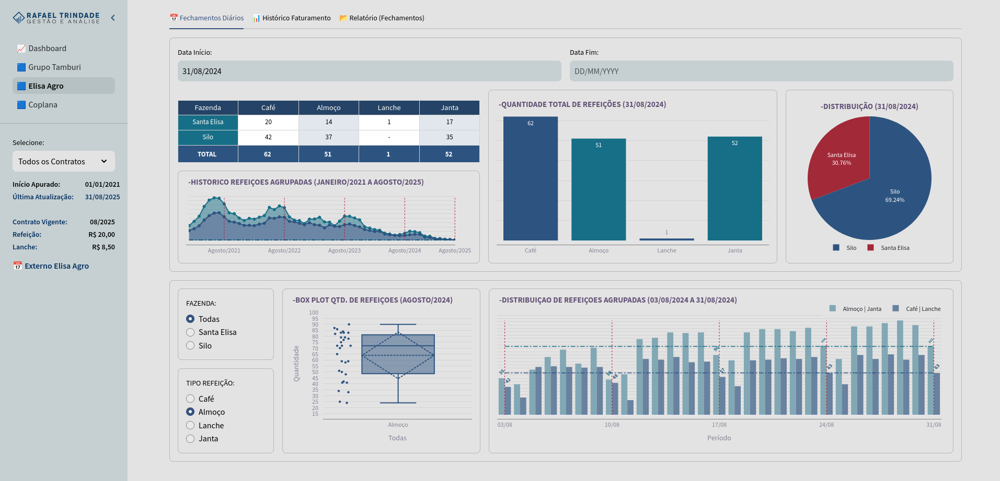
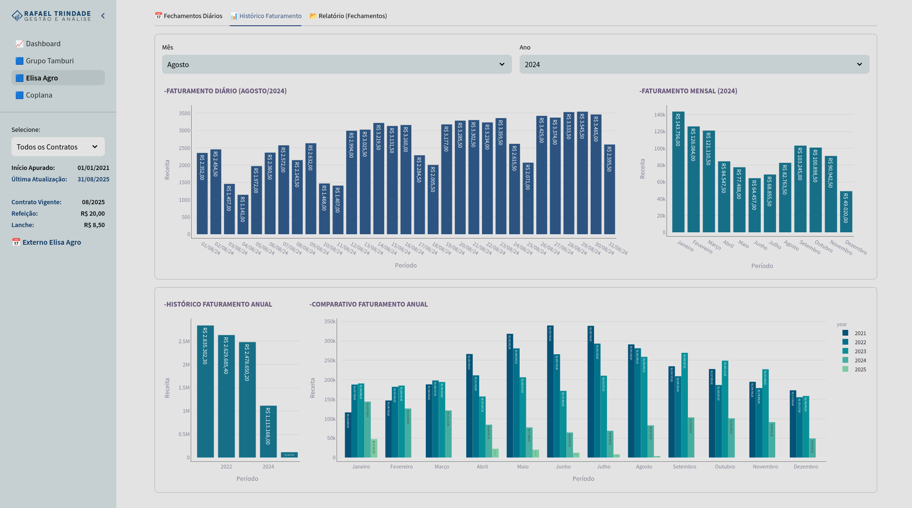
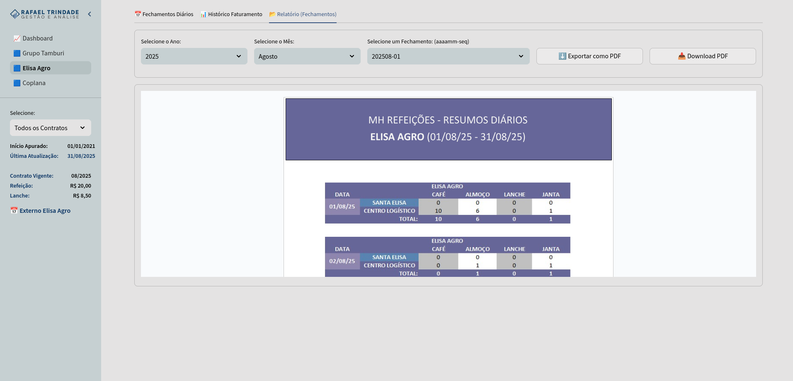

# Dashboard Elisa Agro

Um dashboard interativo desenvolvido com Streamlit para monitoramento e controle das refeições fornecidas às fazendas da Elisa Agro.

## 📋 Sobre o Projeto

Este dashboard foi desenvolvido para permitir que o cliente acompanhem a quantidade de refeições fornecidas para cada fazenda da empresa. A ferramenta oferece uma visualização clara e interativa dos dados de fornecimento de refeições, facilitando o controle e a gestão do serviço.

## 📊 Funcionalidades

- Acompanhamento em tempo real das refeições fornecidas
- Visualização detalhada por fazenda
- Histórico de fornecimento de refeições
- Gráficos e relatórios interativos
- Filtros por período e unidade
- Download de relatório (fechamentos) no formato PDF

## 📸 Capturas de Tela

#### - Painel Principal (Cliente)

#### - Painel Principal (Interno)

#### - Histórico Faturamento (Interno)

#### - Relatórios (Fechamentos) (Cliente e Interno)

